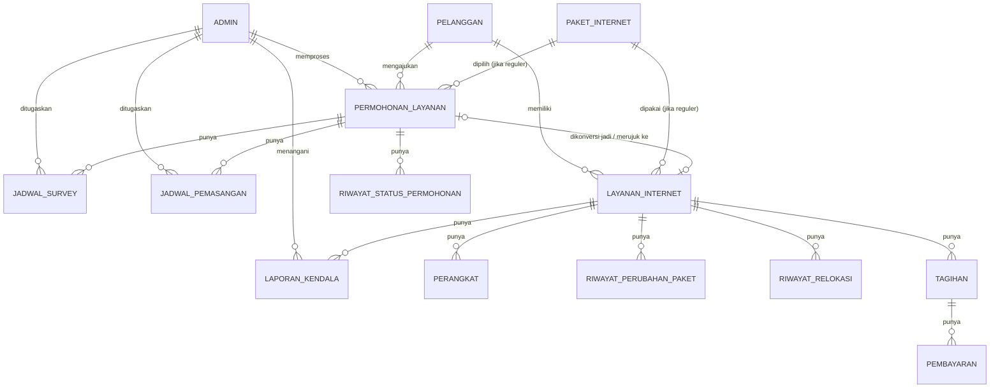

# Entity Relationship Diagram

## Diagram

## Konsep Inti

**Pelanggan memiliki satu atau lebih Layanan Internet.** Setiap layanan berasal dari sebuah Permohonan Layanan yang melalui proses verifikasi, survey, dan pemasangan sebelum resmi menjadi layanan aktif.

## Relasi Khusus: `permohonan_layanan` ↔ `layanan_internet`

Relasinya **bergantung pada `jenis_permohonan`**:

| jenis_permohonan | Perilaku saat status → `DIKONVERSI` |
|---|---|
| `pemasangan_baru` | Membuat **baris baru** di `layanan_internet`. Jika ini layanan pertama pelanggan, generate `nomor_pelanggan` + buat kredensial login. |
| `relokasi` | **Tidak** membuat baris baru. Meng-update alamat/koordinat pada `layanan_internet` yang sudah ada (dirujuk lewat `permohonan_layanan.layanan_internet_id`), lalu mencatat `riwayat_relokasi`. |

## Ringkasan Kardinalitas

- 1 `pelanggan` → N `permohonan_layanan`
- 1 `pelanggan` → N `layanan_internet`
- 1 `permohonan_layanan` → N `jadwal_survey` (bisa lebih dari 1 jika sempat `DITUNDA` lalu dijadwalkan ulang)
- 1 `permohonan_layanan` → N `jadwal_pemasangan` (idem)
- 1 `permohonan_layanan` → N `riwayat_status_permohonan` (log tiap transisi status)
- 1 `layanan_internet` → N `perangkat`
- 1 `layanan_internet` → N `tagihan`
- 1 `tagihan` → N `pembayaran` (mengakomodasi retry/percobaan webhook)
- 1 `layanan_internet` → N `laporan_kendala`

## Referensi Detail Kolom

Lihat folder `docs/database/` untuk skema lengkap tiap tabel.
